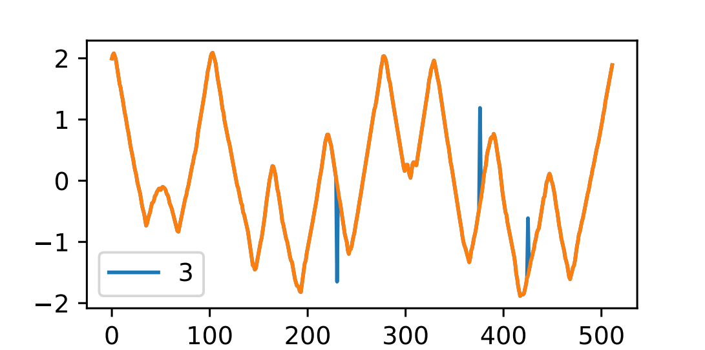
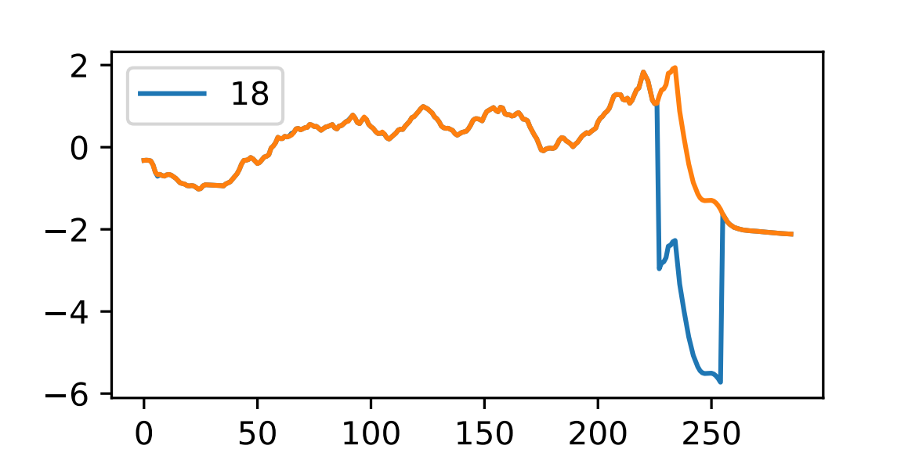
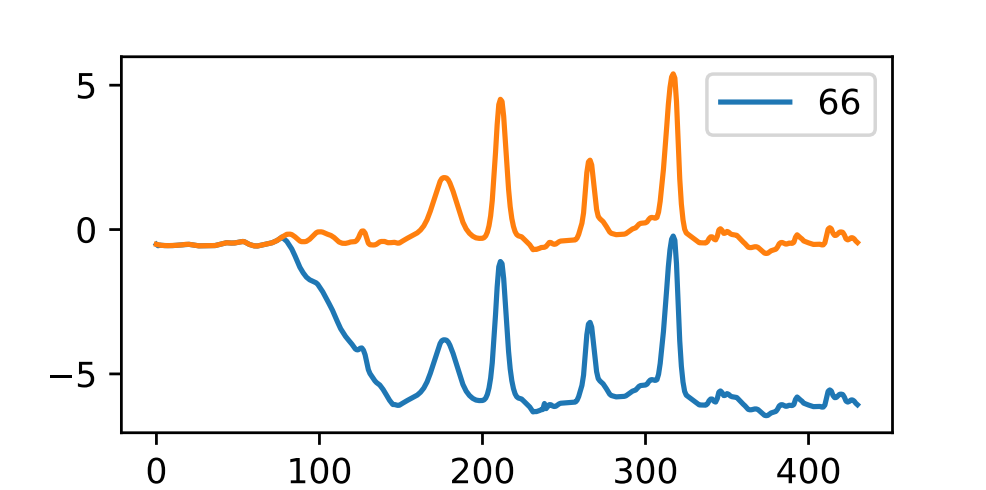
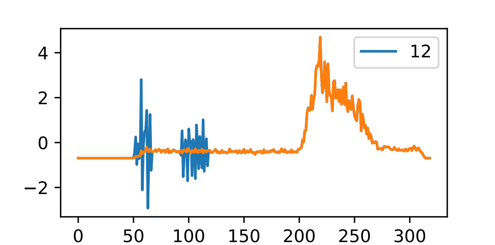

# Time Series Generation Benchmark

This code provides a tool to generate synthetic time series using some of the most common techniques. The sources of the codes used are listed [here](#sources)  

## This repository only contains the sharable (public) part of the code. Since the concatenation tool to reconstruct the results of GANs is absent, the code might not work properly with GAN-based generations


[**Prerequisites**](#prerequisites) | [**Build**](#build) | [**Execution**](#execution) | [**Results**](#results) | [**Examples**](#execution-examples) | [**Plot metrics**](#plot-metrics) | [**BasicGAN 3072 Note**](#basicgan-3072-note) | [**Sources**](#sources) | [**Datasets form**](#datasets-form)
___

## Prerequisites

* **Ubuntu 20.04** (Focal Fossa). 

* Clone this resository

* Python3.6* and pip for python 3

*[How to install python3.6 for Ubuntu 20.04](https://www.snippetbucket.com/ubuntu-20-install-python-3-6/)

___

## Build

* Install the needed libraries and create the virtual environments (takes several minutes)

```
$ sudo sh install_all.sh
```
___

## Execution

* Change the parameters in parameters.json if needed, then run with

```
$ python3.6 main.py
```


## Arguments

| --algorithm        | --dataset                                          | --nb_epochs  | --batch_size | --TimeGAN_seq_len | --Kalman_filter     | --Compute_metrics     | --Show_plot        |
| ------------       | ------------                                       | ------------ | ------------ | ------------      | ------------        | ------------          | ------------       | 
| DBA                | 'datasets/Original_Data/BeetleFly_TEST.csv'        | int > 0      | int > 0      | int > 0           | 1 (-> apply)        | 1 (-> compute)        | 1 (-> show)        |
| InfoGAN            | 'datasets/Original_Data/Coffee_TEST.csv'           |              |              |                   | 0 (-> do not apply) | 0 (-> do not compute) | 0 (-> do not show) |
| TimeGAN            | 'datasets/Original_Data/Ham_TEST.csv'              |  |  |  |  |  |  |
| AnomaliesInjection | 'datasets/Original_Data/Lighting7_TEST.csv'        |  |  |  |  |  |  |
| AR                 | 'datasets/Original_Data/Alabama_weather_6k_8k.csv' |  |  |  |  |  |  |
|                    | 'datasets/Original_Data/Currency2.csv'             |  |  |  |  |  |  |


## Results
For each new dataset, a separate folder is created in the 'results' folder. Inside it, the files 'precision.csv' and 'runtime.csv' groups the statistics for all the generation techniques used with the given dataset. 'data' contains a csv file with the output of each technique, and 'plots' contains a png image with the plot of each technique.

Example after running each of the 5 algorithms on "BeetleFly_TEST.csv" dataset:

```bash
./results/
├── BeetleFly_TEST
│   ├── data
│   │   ├── BeetleFly_TEST_AnomaliesInjection.csv
│   │   ├── BeetleFly_TEST_AR.csv
│   │   ├── BeetleFly_TEST_DBA.csv
│   │   ├── BeetleFly_TEST_InfoGAN.csv
│   │   └── BeetleFly_TEST_TimeGAN.csv
│   ├── plots
│   │   ├── BeetleFly_TEST_AnomaliesInjection.png
│   │   ├── BeetleFly_TEST_AR.png
│   │   ├── BeetleFly_TEST_DBA.png
│   │   ├── BeetleFly_TEST_InfoGAN.png
│   │   └── BeetleFly_TEST_TimeGAN.png
│   ├── precision.csv
│   └── runtime.csv
└── placeholder.txt
```

## Execution examples

1. Generate 5 time series of length 100 using AnomaliesInjection algorithm, with dataset "Coffee_TEST.csv" as input:
```
$ python3.6 main.py --dataset 'datasets/Original_Data/Coffee_TEST.csv' --algorithm AnomaliesInjection --length 5 --nb_series 100
```
2. Run the InfoGAN algorithm on the "Currency2" dataset, for 300 epochs and with a batch of size 200. Then apply the Kalman filter and compute the metrics:
```
$ python3.6 main.py --dataset 'datasets/Original_Data/Currency2.csv' --algorithm InfoGAN --nb_epochs 300 --batch_size 200 --Kalman_filter 1 --Compute_metrics 1 --Show_plot 0
```

3. Run both DBA and AnomaliesInjection on the "BeetleFly_TEST" dataset. For the other parameters, use the values specifies in parameters.json:
```
$ python3.6 main.py --dataset 'datasets/Original_Data/BeetleFly_TEST.csv' --algorithm DBA AnomaliesInjection
```
___


## Other Parameters
The parameters for the synthetic data generation are stored in the file parameters.json, in the main folder (Time_Series_Generation_Benchmark). This can therefore be modified in order to adapt the generation.
Some parameter, for example those for AnomaliesInjection, can only be set through this file, and not directly when the code is runned

(It is to notice that the tsgen implementation also use a parameters.json file, but this is partially overwritten when the code is runned, therefore it might not be usefull to modify it)


Parameters specific for AutoregressiveModel:

| Parameter name | Usage | Possible values | 
| ------------ | ------------ | ------------ | 
| AR\_lag\_window | The lag window to use with the AR model | Integer number > 0, 0 for default (1/4 of the ts length) | 


Parameters specific for Kalman filter:

| Parameter name | Usage | Possible values | 
| ------------ | ------------ | ------------ | 
| Kalman\_remove\_initial | Number of points to remove from the start of the time series after applying filter | Integer number >= 0 | 

Parameters specific for AnomaliesInjection:

| Parameter name | Usage | Possible values | 
| ------------ | ------------ | ------------ | 
| AnomaliesInjection\_nb\_modifications                         | The number of anomalies to insert in the dataset                           | Integer number > 0, or -1 to use default value (average of 1 anomaly per each ts in the dataset) |
| AnomaliesInjection\_multiple\_modification\_per\_ts           | Determines if more than 1 anomaly can be inserted in the same ts           | 1 for True, 0 for False. If 0, AnomaliesInjection\_nb\_modifications should be smaller than the number of ts in the dataset |
| AnomaliesInjection\_seed                                      | Seed for the random generation                                             | Integer number > 0 |
| AnomaliesInjection\_max\_nb\_extreme                          | Maximal number of extreme points (spikes) for each extreme anomaly         | Integer number > 0 |
| AnomaliesInjection\_min/max\_shift/trend/variance             | The minimal/maximal length of each shift/trend/variance anomaly            | Integer number > 0. For each anomaly type, the max value should be strictly bigger than the min value |
| AnomaliesInjection\_extreme/shift/trend/variance\_factor      | The "intensity" of each extreme/shift/trend/variance anomaly               | Integer number > 0 |
| AnomaliesInjection\_probability\_extreme/shift/trend/variance | The probability of each anomaly to be of type extreme/shift/trend/variance | Float number >= 0. If the sum of the 4 probabilities is different than 1, they will be reascaled to ensure this property. If they are all 0, default probabilities (0.25 each) are used |


##  Anomalies Injection Examples
In an "extreme" anomaly, a point is modified to have a much bigger/smaller value that the original one, thus resulting in a spike when the time series is plotted.
<p align="center">
	
</p>


In a "shift" anomaly, all the the records in a given interval are shifted by a given value, which is equal in every point. The result is that a part of the time series is shifted up or down.
<p align="center">
	
</p>

In a "trend" anomaly, a trend is inserted at a given point in the time series. In other words, an increasing (or decreasing) sequence of values is added to a portion of the time series. For example, a time series [1,1,1,1,1,1,1,1,1,1] might become [1,1,1,2,3,4,4,4,4,4]. Notice that after the trend part ([2,3,4]), all the values are modified in order to continue "directly" from the last point (in this example, they are all increased by 3).
<p align="center">
	
</p>


In a variance anomaly, the variance of a random interval is augmented. Visually, this results in something similar to a "vibration".
<p align="center">
	
</p>


___

## Plot metrics

Once the data has been generated, plot metrics with:
```
$ python3.6 plot_metrics.py
```
It is possible to select only specific datasets by indicating their result folder:
```
$ python3.6 plot_metrics.py --dataset results/BeetleFly_TEST results/Coffee_TEST results/Currency2
```


___


## BasicGAN 3072 Note

The code provides an implementation for BasicGAN as well. However, this do *not* work with any of the included datasets.  
It requires a dataset with 3072 time series of length 3072.  

It has been included for consistency with the paper, but its runtime is not direclty measured and the metrics should be extracted manually from the output.


___

## Sources

The codes used in this repo are adapted versions of:

* [Exascale tsgen](https://github.com/eXascaleInfolab/tsgen) -> InfoGAN
* [jsyoon0823 TimeGAN](https://github.com/jsyoon0823/TimeGAN) -> TimeGAN
* [KDD_OpenSource agots](https://github.com/KDD-OpenSource/agots) -> AnomaliesInjection
* [Generating synthetic time series to augment sparse datasets](https://germain-forestier.info/src/icdm2017/) -> DBA
* [Machine Learning Master](https://machinelearningmastery.com/autoregression-models-time-series-forecasting-python/#:~:text=Autoregression%20is%20a%20time%20series,range%20of%20time%20series%20problems.) -> AR
* [dbiir TS-Benchmark](https://github.com/dbiir/TS-Benchmark/tree/master/data_generation) -> BasicGAN3072
___

## Datasets Form

col\_name1, col\_name2, col\_name3, ..., col\_namej  
val11, val21, val31, ..., val1j  
val21, val22, val32, ..., val2j  
..., ..., ..., ..., ...  
vali1, vali2, vali3, ..., valij

In particular, the values should be separated by a '**,**', and each of the j time series should have the **same length**


